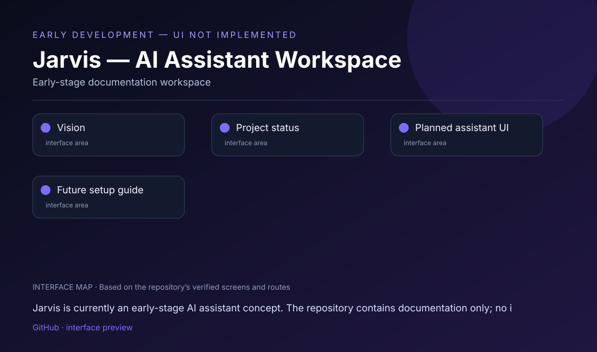

# Jarvis — AI Assistant Workspace

## What this project is

Jarvis is currently an early-stage AI assistant concept. The repository contains documentation only; no interface has been implemented yet.

## Interface at a glance

This repository contains or plans the following visitor-facing areas:

- **Vision**
- **Project status**
- **Planned assistant UI**
- **Future setup guide**

The visual map above is based on the actual repository structure. It is deliberately labeled as an **interface map**, not a fabricated product screenshot.

## Run / view

There is currently no truthful run command because the repository has no source code, package manifest, or app entry point.

**Repository link:** [https://github.com/mahatirmahmud688601-wq/jarvis-](https://github.com/mahatirmahmud688601-wq/jarvis-)

## Project status

> EARLY DEVELOPMENT — UI NOT IMPLEMENTED

A real app screenshot is intentionally not included because no app screen exists yet. The preview below communicates the current project status without inventing a UI.

## Repository notes

- Keep API keys, OAuth secrets, signing keys, and private environment files out of Git.
- Add a verified public demo, APK, or release link here when one is available.
- Add real screenshots from the running app after the required local dependencies and credentials are configured.

## Technology

Early-stage documentation workspace

---

Maintained by [mahatirmahmud688601-wq](https://github.com/mahatirmahmud688601-wq).
